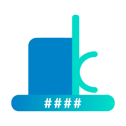

# FRCBot

## ℹ️ [FRCBot is currently being rewritten in TypeScript](https://github.com/cjdenio/frcbot-2.0)

> The version found here is still in production, though the TypeScript version is expected to take its place in a couple months. You can check out the in-process rewrite over here: https://github.com/cjdenio/frcbot-2.0

This app provides FRC integration, right here in Slack! Get info on any FIRST Robotics Competition team, subscribe to match results, get event schedules, and more!

Learn more at https://frcbot.deniosoftware.com

Powered by [The Blue Alliance](https://www.thebluealliance.com)

## How it works

FRCBot uses a [**Node.js**](https://nodejs.org) back-end with the popular [**Express.js**](https://expressjs.com) web framework. The app is hosted on [**Google App Engine**](https://cloud.google.com/appengine/), a serverless platform for hosting web services. Data is securely stored in a [**Cloud Datastore**](https://cloud.google.com/datastore/) database, using the client library for Node.js.

We use The Blue Alliance's [**Read API**](https://www.thebluealliance.com/apidocs) as well as their [**Webhook API**](https://www.thebluealliance.com/apidocs/webhooks) to provide real-time notifications.

Our feedback system (both `/frc feedback` and the [Submit Feedback](https://frcbot.deniosoftware.com/support) page) uses [**99Inbound**](https://99inbound.com) to handle submissions.
